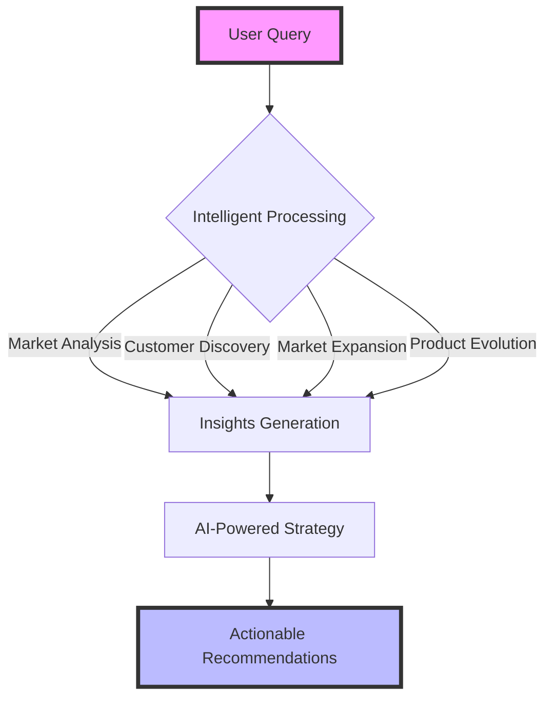
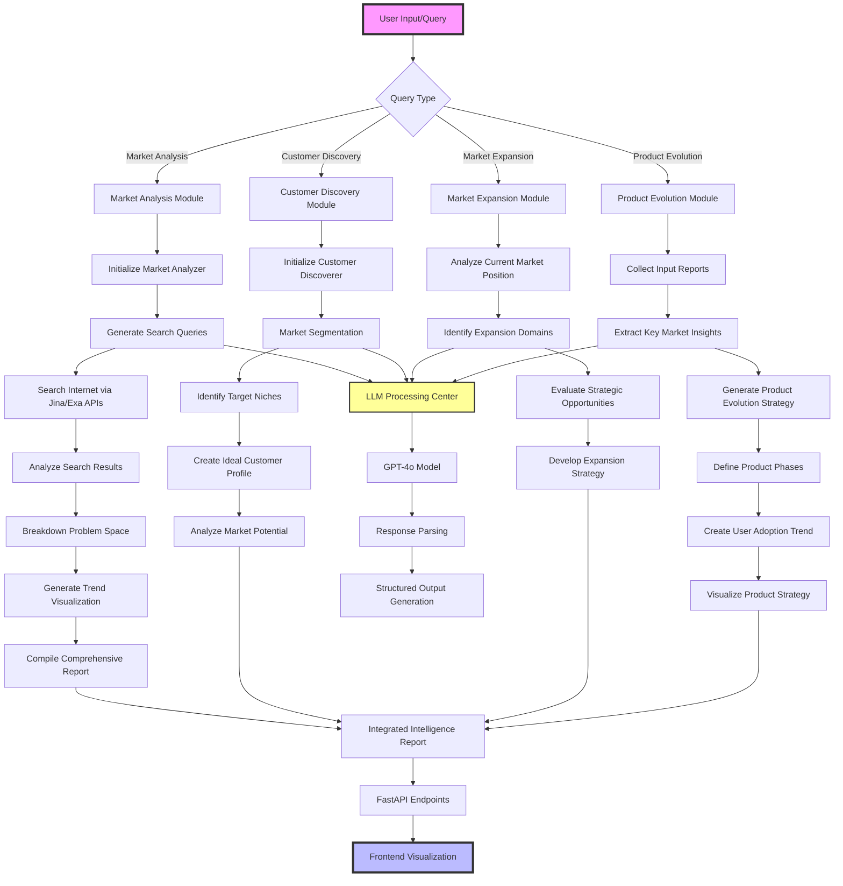

# 100x-engineer-hackathon# 100x Engineer: AI-Powered Market Intelligence Platform

## Overview

This project is an advanced AI-driven market intelligence platform designed to help businesses and entrepreneurs gain deep insights into market dynamics, customer needs, and strategic opportunities.

## System Architecture 

•⁠ ⁠[Detailed System Workflow](docs/workflow_visualizer/system_architecture.md)

## Product Workflow

## Key Features

### 🔍 Market Analysis

•⁠ ⁠Comprehensive market research using advanced AI techniques
•⁠ ⁠Multi-source data aggregation and analysis
•⁠ ⁠Intelligent query breakdown and insight generation

### 🚀 Market Expansion

•⁠ ⁠Strategic market expansion recommendations
•⁠ ⁠Competitive landscape assessment
•⁠ ⁠Opportunity identification and prioritization

### 📈 Product Evolution

•⁠ ⁠Data-driven product evolution strategies
•⁠ ⁠Customer segment targeting
•⁠ ⁠Risk mitigation and success metrics tracking

## Technologies

•⁠ ⁠*Backend*: FastAPI
•⁠ ⁠*AI Integration*: LiteLLM, OpenAI
•⁠ ⁠*Search APIs*: Jina AI, Exa
•⁠ ⁠*Data Modeling*: Pydantic
•⁠ ⁠*Database*: SQLAlchemy

## Getting Started

### Prerequisites

•⁠ ⁠Python 3.10+
•⁠ ⁠Poetry (dependency management)

### Installation

⁠ bash
git clone https://github.com/yourusername/100x-engineer.git
cd 100x-engineer
poetry install
 ⁠

### Environment Configuration

Create a ⁠ .env ⁠ file with the following variables:
•⁠ ⁠⁠ OPENAI_API_KEY ⁠
•⁠ ⁠⁠ JINA_API_KEY ⁠
•⁠ ⁠⁠ EXA_API_KEY ⁠

### Running the Application

⁠`bash
streamlit run src/frontend/app_page.py
 ⁠`

## Core Modules

•⁠ ⁠*Customer Discovery*: Advanced customer segmentation

•⁠ ⁠*Market Analysis*: Comprehensive market research

•⁠ ⁠*Market Expansion*: Strategic growth recommendations

•⁠ ⁠*Product Evolution*: Data-driven product strategy

## Workflow Visualizations

Detailed workflow diagrams are available to understand the internal processes of our core modules:

### 📊 Workflow Visualizers

•⁠ ⁠[Customer Discovery Workflow](docs/workflow_visualizer/customer_discovery.md)

•⁠ ⁠[Market Analysis Workflow](docs/workflow_visualizer/market_analyser.md)

•⁠ ⁠[Market Expansion Workflow](docs/workflow_visualizer/market_expansion.md)

•⁠ ⁠[Product Evolution Workflow](docs/workflow_visualizer/product_evolution.md)

These Mermaid-based flowcharts provide insights into the AI-driven processes powering our intelligent market research platform.

## Contributing

1.⁠ ⁠Fork the repository
2.⁠ ⁠Create your feature branch (⁠ git checkout -b feature/AmazingFeature ⁠)
3.⁠ ⁠Commit your changes (⁠ git commit -m 'Add some AmazingFeature' ⁠)
4.⁠ ⁠Push to the branch (⁠ git push origin feature/AmazingFeature ⁠)
5.⁠ ⁠Open a Pull Request

## License

Distributed under the MIT License. See ⁠ LICENSE ⁠ for more information.

## Contact

Your Name - rishub@craftsmanlabs.net
