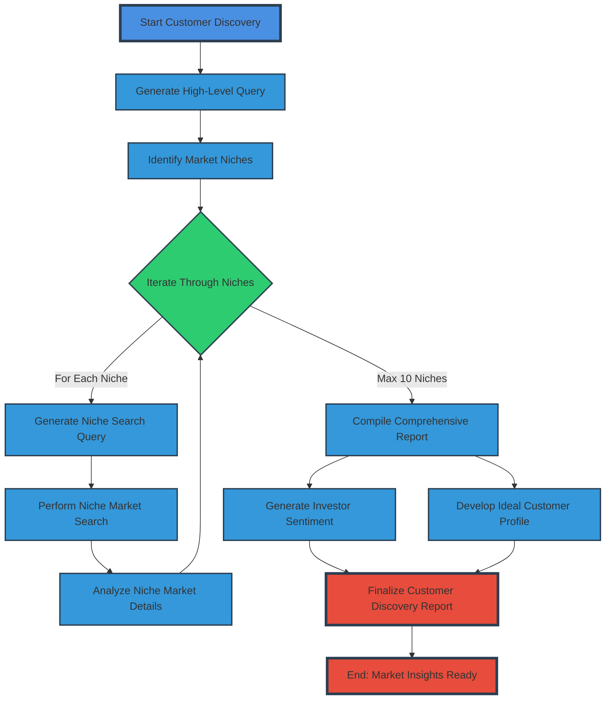

# Customer Discovery Workflow

```mermaid
flowchart TD
    A[Start Customer Discovery] --> B[Generate High-Level Query]
    B --> C[Identify Market Niches]
    C --> D{Iterate Through Niches}
    D --> |For Each Niche| E[Generate Niche Search Query]
    E --> F[Perform Niche Market Search]
    F --> G[Analyze Niche Market Details]
    G --> D
    D --> |Max 10 Niches| H[Compile Comprehensive Report]
    H --> I[Generate Investor Sentiment]
    H --> J[Develop Ideal Customer Profile]
    I --> K[Finalize Customer Discovery Report]
    J --> K
    K --> L[End: Market Insights Ready]

    classDef start fill:#4a90e2,stroke:#2c3e50,stroke-width:4px
    classDef process fill:#3498db,stroke:#2c3e50,stroke-width:2px
    classDef decision fill:#2ecc71,stroke:#2c3e50,stroke-width:2px
    classDef endNode fill:#e74c3c,stroke:#2c3e50,stroke-width:4px

    class A,L start
    class B,C,E,F,G,H,I,J process
    class D decision
    class K,L endNode
```
