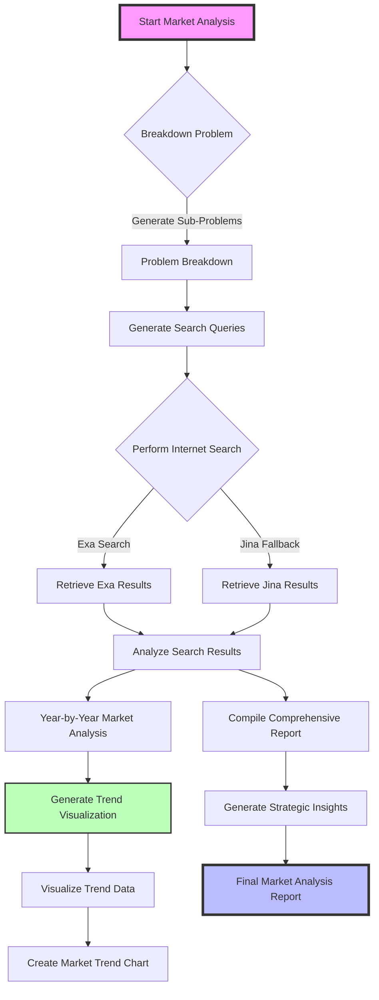

# Market Analyzer Workflow Diagram

> Visualizes the comprehensive process of market analysis using advanced AI techniques

## Overview
This Mermaid.js diagram illustrates the step-by-step workflow of the MarketAnalyzer class, 
demonstrating how complex market research is conducted through intelligent decomposition, 
search, analysis, and visualization.

## Key Processes
- Problem Breakdown
- Search Query Generation
- Internet Research
- Trend Visualization
- Strategic Reporting

