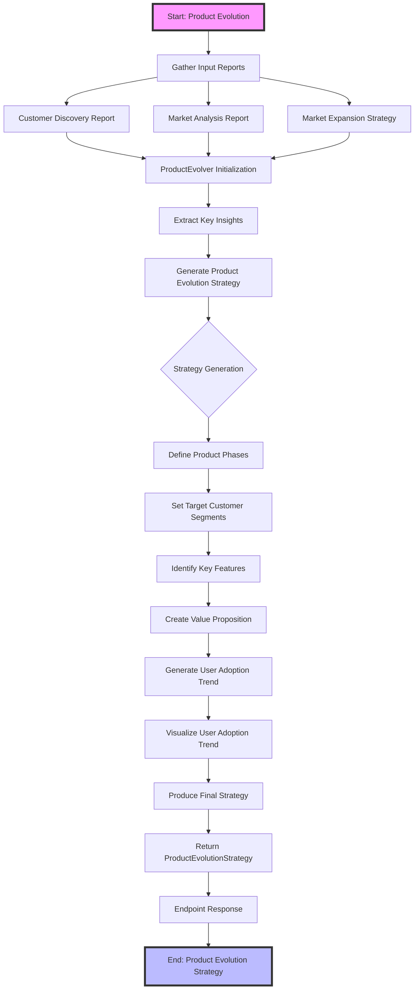

# Product Evolution Workflow

This Mermaid.js diagram illustrates the comprehensive workflow of the Product Evolution Strategy generation process.

## Workflow Description

The Product Evolution workflow is a systematic process that transforms market insights into a strategic product development roadmap. It involves:

1. **Input Collection**: Gathering comprehensive reports from customer discovery, market analysis, and market expansion strategies.
2. **Insight Extraction**: Analyzing key market niches, customer profiles, trends, and expansion opportunities.
3. **Strategy Generation**: Creating a multi-phase product evolution plan with detailed considerations for each phase.
4. **Trend Visualization**: Generating and visualizing user adoption trends to support strategic decisions.

### Key Components
- **Input Reports**: Customer Discovery, Market Analysis, Market Expansion
- **ProductEvolver**: Orchestrates the entire evolution strategy generation
- **LLM Integration**: Uses advanced language models to generate strategic insights
- **Visualization**: Creates trend graphs to illustrate potential user growth

### Endpoints
- `/product-evolution/evolve`: Generates the complete product evolution strategy
- `/product-evolution/user-adoption-trend`: Produces user adoption trend visualization
