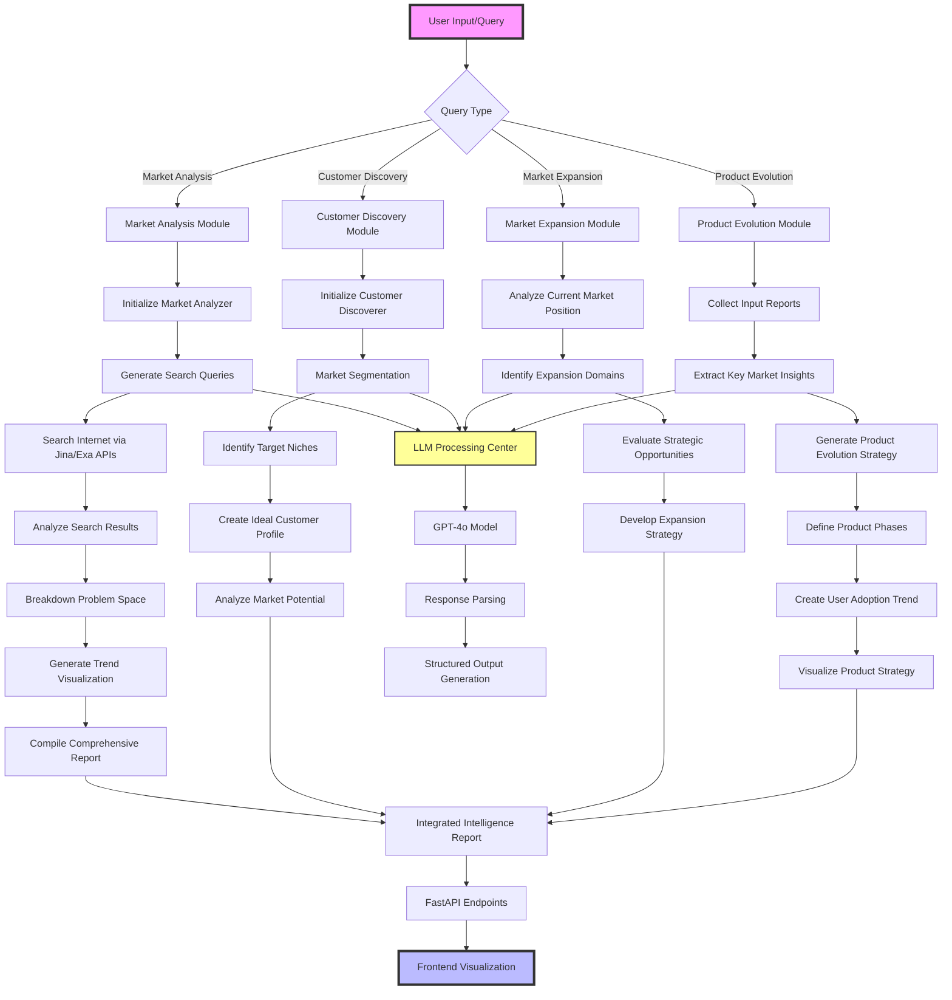

# 100x Engineer: Comprehensive System Workflow

## System Architecture Overview

This comprehensive workflow diagram illustrates the intricate processes of the 100x Engineer AI-powered market intelligence platform. The system is designed to handle complex market research and strategic planning tasks through modular, AI-driven workflows.

### Key Components

- **Input Processing**: Flexible query handling
- **Modular Workflow Modules**:
  - Market Analysis
  - Customer Discovery
  - Market Expansion
  - Product Evolution
- **AI Processing Center**: Centralized LLM-powered intelligence
- **Integration Layer**: Combining insights from multiple modules
- **Output Generation**: Structured reports and visualizations

### Technology Stack

- **AI Model**: GPT-4o
- **Backend**: FastAPI
- **Search APIs**: Jina, Exa
- **Data Processing**: Pydantic, LiteLLM

### Workflow Characteristics

- **Adaptive**: Handles diverse query types
- **Intelligent**: AI-powered insight generation
- **Comprehensive**: Multi-dimensional market analysis
- **Visualized**: Clear, structured output generation
